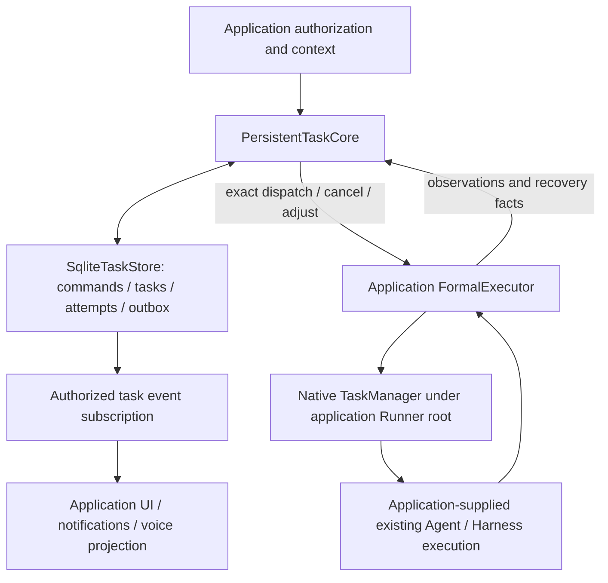

# Persistent application tasks

The extraction baseline is `b5f189ba1054a338d8fa3e009b13053776340e44`. The current
paired development version is `0.1.17+livevoice.9`. Initial extraction alone did not
establish native integration. Work orchestration and formal project attempts now
run through the existing TaskManager under the consuming Host Runner root. Their
durable business state remains in the application stores. Controller, TeamAgent
and Harness task APIs retain their own semantics and existing consumers.

The 2026-09-15 management review does not consider that execution wiring a
completed management unification. Work now delegates native settlement to
TaskManager's existing finalizer, removing its separate native-completion watcher.
Its asyncio Future is only a predecessor/shutdown waiting adapter. Formal Task
artifact collection also reuses the existing applied-artifact reader used by
checkpoint and recovery, removing a second path/hash loop and an unused verifier.
Neither change replaces TaskStore/WorkStore's transaction or business state.

## Capability comparison and reuse decisions

| Existing capability | Code and call flow | Relationship to this addition |
| --- | --- | --- |
| Coroutine task management | `core/runner/runner.py:get_root_task_group`; `core/common/background_tasks.py:create_background_task`; `task_manager/manager.py:create_task/task_group` and `task.py:execute/cancel` | Runner already owns a process-lifetime root group. Explicit binding can outlive a caller group; a native task can stay pending through shielded cleanup after cancel timeout. These capabilities are verified, so native ownership must not be described as missing. Work still owns durable UNKNOWN/CAS/replay and capacity facts. WorkRuntime now calls TaskManager.create_task for its orchestration; DirectProjectCodeExecutorAdapter does so for its actual _run_attempt coroutine. Both detach the native parent identity from the Voice caller. Native transient status cannot replace durable truth. |
| Controller tasks | `core/controller/schema/task.py`; `TaskManager.add_task/get_state/load_state` maintains indexed session tasks; `TaskScheduler` selects a registered executor by task type and streams its output | Reuse for Controller execution. Its task/session state, pause and output events are not the durable command/attempt/outbox protocol. Do not map a scheduler cancellation boolean to a committed delivery result. |
| Team tasks | `agent_teams/tools/task_manager.py`, `tools/database/task_dao.py`; task tools call the manager/DAO and publish team events for assignment, dependencies, completion and review | Reuse for team decomposition and coordination. A team's subtask ID is not automatically a user delivery ID or an execution attempt ID. No second team scheduler is added. |
| Harness asynchronous tools | `agent_teams/harness/async_tools.py`; invoke launches an async tool, tracks status/output, and injects completion via the owning harness; `tools/tool_async.py` provides list/output/cancel | Retain as the async tool runtime. It does not by itself prove durable outbox delivery, project effects or safe restart/retry. No duplicate async-tool loop is added. |
| Subagent execution | `harness/tools/subagent/task_tool.py` and existing Agent/Runner/model/tool loop | Remains the execution mechanism. The new core receives an application-supplied executor, not model credentials or a new Agent. |
| Session/checkpoint facilities | Existing session state and Agent checkpoint mechanisms | Retain for Agent execution state. New durability records bind the exact task/attempt/profile and external-effect prefix; they do not substitute a second conversation-memory implementation. |

The missing layer is durable **delivery authority**: accepted command versus
dispatched attempt, fenced adjustments and cancellation, at-most-once command
replay, scoped results, unknown outcomes and verified recovery facts. Those
responsibilities are additive to execution scheduling. No claim is made that
existing Controller or TeamAgent consumers now automatically use this store.

## Ownership and flow

This shows the normal Host project-execution path. The injected FormalExecutor
contract also supports application implementations with their own execution owner;
the SDK does not force every consumer through the Host Runner.



- `formal_task_models.py`: immutable task, attempt, authority, result and recovery contracts.
- `task_store.py`: SQLite authority, exact command replay, attempt/outbox transactions and result facts.
- `persistent_task_core.py`: authorization and delivery orchestration through `FormalExecutor`.
- `task_adjustment_queue.py`: ordered changes and successor cutover without rewriting predecessor results.
- `task_event_subscription.py`: scoped event delivery and authoritative replay.
- `executor_capabilities.py`, `file_effect_plan.py`: executor declarations and file-effect contracts.
- `durability/`: checkpoint/effect identity, prefix verification, recovery facts and single-operation authorization.
- `contracts.py`: shared command/query/result/scope/progress values. Applications retain concrete identity and committed-input ledgers behind admission protocols.
- `source.py`: trusted, immutable source evidence codecs. Unknown or malformed evidence fails closed.

The initial admission profile deliberately retains the existing **project-mutation**
requirements, including exact model configuration and project-write context.
This is not yet a replacement for arbitrary read-only Work. Making admission
profiles generic is a separate behavioral change and is not silently introduced.

## JiuwenSwarm adapter boundary

JiuwenSwarm now imports this implementation. It still owns project authorization,
confirmation, model resolution, the concrete project/Agent adapter, and voice/UI
projection. Its `NativeTaskSource` implements `TaskSourceEvidence` and registers
the existing source version during module initialization. SDK code has no
JiuwenSwarm import and contains no Realtime client, microphone, turn ledger or UI.

The project execution algorithm belongs to SDK DirectProjectCodeExecutorAdapter:
checkout, attempt journal, apply, effect verification and cleanup. JiuwenSwarm
supplies ProjectExecutionApplication and binding resolution for its project
registry, configured Agent facade, permissions and tool registration. AgentServer
passes AgentRuntime.ensure_background_task_group through the P3 factory; the SDK
uses that root without importing the Host. Standalone/custom consumers may retain
the existing asyncio mode, using the same attempt algorithm and durable authority.

Applications instantiate `SqliteTaskStore(path)` and
`PersistentTaskCore(store, executor)`, validate their entrypoint, then call
`execute(command, grant, context=resolved_context)` and drain the outbox. A
successful creation receipt means accepted, not executed. An executor must
return exact attempt observations; queued, timeout and unknown must not claim
completion. `tests/integration_tests/application_tasks/test_application_boundary.py`
is a runnable application-independent admission/delivery/reopen example.

## Compatibility and verification

SQLite schema version 6 and existing serialized identifiers/keys remain unchanged.
Legacy wire strings (`live-voice.contract.v2`, `native_source`, and namespaced
extensions) remain readable; they are compatibility values, not SDK imports.
The originating application's source decoder remains mandatory when source data
is present. A missing decoder never downgrades a record to legacy/no-source.

Run:

```powershell
python -m pytest -q -o addopts= -o asyncio_mode=auto tests/integration_tests/application_tasks
python -m ruff check openjiuwen/core/application/tasks tests/integration_tests/application_tasks
```

These tests use real temporary SQLite files and deterministic executor facts.
They establish SDK/storage boundaries, not physical voice or cloud-model acceptance.

## Local distribution

The current branch package version is `0.1.17+livevoice.9`; official `0.1.17` does not
contain this addition and must not satisfy the consuming application's pin.
JiuwenSwarm uses the sibling `../agent-core` editable uv source for local
work. For wheel installation, install the matching SDK wheel together with
the Host wheel. Neither this version nor the branch commit is assumed published.

Validation for this migration: 102 SDK application-task tests, plus 57 existing
Controller TaskManager/TaskExecutor tests pass (159 combined). Ruff passes.
Host integration additionally exercises task creation/delivery, SQLite replay,
adjust/cancel/recovery, project file effects, real SDK tool registration and
source validation. A wheel-to-wheel import verifies the packaged Host uses the
packaged SDK task implementation. Physical audio/cloud-model acceptance and
migration of Work were outside that initial change. The Work follow-up is below.

## Project execution ownership (2026-09-13 follow-up)

`DirectProjectCodeExecutorAdapter` now belongs to this SDK. It owns the attempt
journal, exact dispatch/cancel/adjust handling, isolated Git checkout, protected
file verification, apply/cleanup settlement and durable recovery. Existing
database tables, profile identifiers and legacy serialized strings are retained.
Their historical `live_voice`/`jiuwenswarm` spelling does not introduce an import
dependency or a second implementation.

Construct it with a `ProjectExecutionApplication` implementation. The application
maps immutable `ProjectTaskInvocation` values to its Agent request, supplies the
execution guard and protected runtime-support paths, and may supply telemetry.
Project/configuration resolution remains behind `ProjectExecutionBindingResolver`.
The SDK does not select a user's Agent, instantiate a JiuwenSwarm request, or
grant project permissions. JiuwenSwarm's subclass supplies only this integration.

`execution_checkpoint` provides one process-local checkpoint identity shared by
executor, Agent callback and the file-effect declaration tool. Wrong-session or
closed checkpoint access fails; adjustment adoption cannot forge user authority.
`TaskResultReader` verifies exact Task/Attempt ownership and artifact hashes before
bounded content disclosure. Dialogue context selection and voice playback remain
application responsibilities.

The SDK-only project test applies a real local Git/file result and reopens its
attempt journal without replaying the Agent. Host regression covers current D2
execution, original-file/index preservation, cancel/adjust, partial effects and
restart. Existing synchronous filesystem authority checks are retained during
extraction; their four explicit lint exceptions avoid changing scheduling in a
behavior-preserving migration. No cloud latency policy changes are included.

## Work ownership (2026-09-13 follow-up)

`WorkRuntime` and `SqliteWorkStore` own admitted analysis work, revisions,
deduplication, exact-scope queries, cancellation settlement and checkpoint CAS.
Admission is saved before scheduling the injected runner. Reopening a checkpoint
whose process execution ownership was lost records UNKNOWN; it never replays
Agent/tool effects or invents completion. Work and project Tasks can use the same
SQLite file without creating a Task for every analysis.

The application supplies the configured Agent runner and authorized context;
its source/input journal and presentation receipts remain application-owned.
Store initialization/validation hooks keep those tables in the same transaction
without introducing application imports into the SDK. Existing wire fields,
table names, bounds and error strings remain compatible.

`execution_control` shares transient interaction control and read-only await
settlement. Admitted Work clears the transient caller context, so stopping speech
does not silently cancel accepted work. Persistent writes never use the read-only
cancellation helper. `observation` owns bounded cursor validation for SDK waits
and application queries; no Host package is required, including deferred calls.

This extends SDK application execution, rather than replacing Controller tasks or
AgentTeam AsyncToolRuntime. The latter owns per-harness background tools and does
not provide this checkpoint/revision/UNKNOWN contract. Task remains responsible
for authorized project mutations, durable attempts, outbox and verified effects;
Work remains the lighter analysis lifecycle. They reuse contracts and execution
primitives without pretending those different state meanings are interchangeable.

## Code-level integration audit (2026-09-13)

The current cleanup removes `LegacyProjectTaskService` and the unused `service`
member of `ProjectExecutionBinding`. No production executor read that member;
only historical scheduler fixtures used it. The consuming Host no longer passes
or starts/stops a legacy carrier; SDK project execution and Host Agent cleanup
remain the actual owners. Historical carrier bindings belong to test support.
This is a paired development-branch `.4` change: external callers constructing
`.3` bindings with `service=` or importing the removed protocol must update.
No claim of compatibility with unknown direct `.3` consumers is made.

The broader addition still does not replace Controller or Team task management.
`TaskManager.get_state/load_state` copies Controller session task/index state;
`TaskScheduler.cancel_task` requests executor cancellation and marks CANCELED.
Team DAO assignment/dependency/review transactions own different coordination
facts. Harness async tool completion also injects into its owning harness.
None of these inspected paths establishes the application's durable outbox,
exact attempt/effect settlement or Work checkpoint CAS. Existing Agent/tool
execution is reused; durable delivery remains an added subsystem, whose wider
management convergence is unproved.

A root-registered checkpoint Rail replacement failed a real wrong-Agent tool
case and was reverted. The final TaskCheckpointRail uses the existing native
AgentCallbackManager's new scoped_agent_rail entry instead. Host supplies only
cached-instance and session identity readers; its dynamic presentation-rail
checkpoint callback fields have been removed. Physical voice, running-cancel
user acceptance and current external-provider behavior are not established by
these checks.

### Execution-scoped native rails

`openjiuwen.core.single_agent.agent_callback_manager.scoped_agent_rail` binds an
AgentRail to the current Python execution context, including inherited async
tasks. Ordinary callers without a scope keep their existing callback behavior.
This opt-in facility never registers process-global callbacks or tools. Callback
failures propagate. Nested scopes execute outer-to-inner, independent of normal
registry priorities. After scope exit, inherited tasks fail closed, including
when exit happens while a callback is suspended. Callers must keep the scope
open through actual stream cleanup; it is not a sandbox against trusted Python
code explicitly replacing its execution context.

```python
from openjiuwen.core.single_agent.agent_callback_manager import scoped_agent_rail
from openjiuwen.core.single_agent.rail.base import AgentCallbackEvent

# task_rail is a TaskCheckpointRail with application-owned identity adapters.
with scoped_agent_rail(
    task_rail,
    before_events=frozenset({AgentCallbackEvent.BEFORE_TOOL_CALL}),
):
    # Consume and close the existing SDK Agent stream in this same scope.
    ...
```

By default scoped hooks run after ordinary registered hooks. `before_events`
selects hooks that must precede ordinary projection callbacks: Task tool-plan
validation rejects before tool_call/history emission, while model adoption
runs after ordinary model-context preprocessing. Hooks are trusted SDK code;
this does not authorize arbitrary later hooks to rewrite protected arguments.
The inspected Host hook only cleans call_goal for file tools. Applications
using argument-rewriting hooks must preserve the same authorization boundary.


### Atomic application authority reads (.5)

`SqliteTaskStore.list_task_authority_snapshots_page(scope, cursor=None, limit=...)`
returns `(snapshots, next_cursor, has_more)`. Each `TaskAuthorityReadSnapshot`
contains the Task, current Attempt/admission, canonical event head and result
availability/record/reason from one SQLite read transaction. It reuses ordinary
keyset paging and existing row decoders. A missing event head fails closed;
this reader neither repairs storage nor authorizes a command.

An application may project product permissions and result digests from this
snapshot without polling the Task page twice for convergence. Later mutations
remain subject to their existing command preconditions. Ordinary page APIs retain
their signatures and behavior; a sequence of separate pages is not one atomic
collection snapshot. Callers requiring a complete bounded collection must reject
`has_more`/a next cursor, as the paired Host adapter does.

Real SQLite tests cover concurrent completion/insertion between task and auxiliary
reads, original pagination/attempt isolation, wrong subject/project/session,
invalid bounds, missing event heads and no read-side writes. Pair the Host's new
aggregate consumer with `0.1.17+livevoice.5`; `.4` lacks this method. There is no
persisted schema migration or reverse Host dependency.


### Shared durability validation

Checkpoint, effect, recovery and verified-prefix values reuse the existing
`durability_identity` text, authenticated-scope and profile validators. Each binds
its own exception type, reason and field label. Removed duplicate algorithms do
not change accepted values, canonical encoding, error causes, persistent schema
or public exports. Exact strings and the 512-byte UTF-8 bound remain distinct
from transport identity rules. Validation never grants recovery or dispatch
permission; Store transactions and executor fences remain authoritative.


### Shared subscription lifecycle and durable consumption (.6)

`TaskEventSubscription` now also reads the existing Store consumer authority
pages with `enabled=True, authority_atomic_replay=True, consumer_scope=True,
presentation_class="text"` (or `"voice"`). JiuwenSwarm's
`TaskEventAuthorityProgressSource` directly constructs this SDK reader for all
three modes; its separate consumer subscription implementation is removed.
The Store remains the only owner of persisted cursors and canonical event facts.
The reader never ACKs a presentation or changes a Task/outbox record.

| Mode | Start position | Read management | Cancellation of next_event |
|---|---|---|---|
| Default live-only | Current Store head | Existing background tail | Detaches reader |
| Authority prefix, no presentation_class | Validated current-attempt prefix | Prefix then existing background tail | Detaches reader |
| Authority consumer pages | Durable text/voice watermark | Demand pages, frozen head while paging | Cancels that wait; reader remains active |

Consumer pages preserve idempotent `start()` results, bounded rolling identity
validation, delayed ACK advancement through an already-read prefix, and replay
across historical attempts. Only the current terminal closes that stream.
`consumer_cursor_baseline()` returns the Store-proven cursor after start;
`consumer_terminal_closes_stream(event)` distinguishes current from historical
terminal events for the application projection. Both are read-only.
Queue, authorization, state snapshots, close intent and owner-loop handling reuse
the existing SDK manager. Initialization and close intent share its lock; a close
that wins before queue allocation prevents event delivery. Cursor page validation
is retained mode-specific code, not counted as eliminated behavior.

Host consumers of this additive API require `0.1.17+livevoice.6`. There is no
schema migration or change to older call defaults. Presentation/heard-history
ACK policy remains an application responsibility; no SDK-to-Host dependency.


### Historical Work ownership characterization (superseded by .8 below)

`tests/integration_tests/application_tasks/test_work_native_task_ownership.py`
uses the actual Runner root owner, TaskManager and BackgroundTask with real
SQLite Work checkpoints. Inherited caller-group cancellation stops a native
background task; explicit root binding preserves it. Current Work remains alive
in both cases and stores its completed result. A second scenario shows native
cancel returning while shielded cleanup keeps the handle pending, alongside
Work persisting UNKNOWN, retaining capacity and rejecting replacement work until
physical settlement. All three cases pass. The producers are controlled
coroutines; this is not a full Runner.start, Host startup or Agent/Provider run.

This corrects the earlier incomplete exclusion of native task management based
on caller lifetime/cleanup capability. Runner root reuse is a concrete candidate.
Before wiring Work to it, verify cancellation of the Work orchestration itself:
AnyIO cancellation propagation, its independent runner and settlement futures,
admission-before-scheduling failures, capacity retention, restart UNKNOWN and
Host shutdown retry must retain current guarantees. No production adapter or
new task group is introduced by these characterization tests.


### Historical native-root implementation (.7; superseded by .8 below)

The earlier audit-only paragraphs above are historical. HostWorkService now passes
AgentRuntime.get_background_task_group into WorkRuntime; managed Host resolves
Runner.get_root_task_group and rejects unavailable/unstarted ownership before
admission is persisted. The existing root starts the Work orchestration directly.
A Future only reports coroutine completion; no second business state is created.
Custom initializer/standalone SDK ownership remains compatible. WorkStore and
revision/CAS/capacity/restart UNKNOWN semantics remain necessary domain authority.
This is root lifecycle reuse, not TaskManager registry or full Task/Work convergence.

Native cancellation before first execution is checked before RUNNING/producer
allocation (real root red/green test); closed-group scheduling retains UNKNOWN
without executing or replaying the request. Independent producer/cleanup must
settle before capacity or success is published. Cleanup-phase cancel/deadline
uses existing bounds and publishes UNKNOWN while physical cleanup remains owned.
No Voice timeout, database schema, project authorization or Task-card policy changed.

SDK real native/SQLite: 11 passed (1.94s); Host existing Work regressions: 37 passed
(7.10s); real Runner.start/stop + Host/SQLite probe: 1 passed (7.48s). The latter
isolates external checkpointer/extensions, not Runner or Work. Read-only review
found no remaining concrete blocker in the three production files; this is not
full candidate acceptance. At that intermediate checkpoint paired wheel validation
remained pending; its
completed result is recorded in the final .7 batch paragraph below.

Same-basis production delta this batch: Voice 0, Host +13, SDK +57 = +70.
Current official-baseline net: Voice 112334, Host 48028, SDK 34056 = 194418;
1262 fewer than audit start 195680. This batch is necessary ownership/settlement
enhancement and Host adaptation, not relocation or bulk duplicate deletion.


Final batch verification: SDK 11 passed (1.94s), Host 38 passed (10.00s).
SDK .7 and Host matching pins built and installed to an isolated target;
12 native/SQLite scenarios passed there, including real Runner start/stop.
All 1016 Host / 2409 SDK installed Python files match current source bytes.
An initial reused Host build directory resurrected deleted task_core.py;
that artifact was rejected and a clean temporary source build passed the
complete file comparison. No source rollback, repository cleanup or deployment.
Ruff on changed SDK source/test and git diff --check passed. Third-party
dependencies reused the local environment; no full dependency-resolution claim.
This closes only this native-root/settlement batch, not the overall goal.


### Native TaskManager integration (.8, retained in .9)

Work now calls the existing TaskManager.create_task inside the Host-owned Runner
root. The native registry, coroutine execution, cancellation scope and task events
manage that orchestration. Its parent task identity is explicitly detached from
the Voice caller; a real cascade_cancel probe confirms caller closure does not
cancel accepted Work. The existing completion Future is only an asyncio waiting
adapter, not another execution state or durable result ledger. WorkStore remains
the business authority for revision/CAS, UNKNOWN/no replay and physical settlement.
A native coroutine may finish while the durable Work outcome is UNKNOWN: these
are distinct facts, and native task entries never create formal product Task cards.

The existing native Task lifecycle now covers failed/cancelled start callbacks,
closes unstarted coroutines and restores task context. TaskManager's optional
synchronous on_scheduled receipt retains the actual Task before asynchronous
creation callbacks; their existing order and exception propagation are unchanged.
The existing synchronous BackgroundTask helper uses it, so already-returned
handles no longer hang after creation failure. The asynchronous create helper
still raises creation errors as before; Work retains ownership through the receipt.
No separate native task registry or new scheduler framework was added.

Real Work integration exposed logging's deepcopy of AbortError failing while
handling the original exception. Existing BaseLogEvent serialization now excludes
only the exception object from deepcopy, retaining its prior string/error fields
and deep-copying all other data. Native callback failure before Work starts has
zero body effects; failure after start produces UNKNOWN and holds capacity through
cleanup; a late observer failure does not erase an already settled real result.

Verification: 84 SDK/native/message-queue/SQLite tests passed (6.81s), followed by
the updated two root/native cancellation cases (1.61s) and three callback cases
(1.64s). Host Work regressions: 38 passed (10.23s). Counts overlap. Independent
read-only review found no concrete blocker in the current integration. Ruff passed
with existing ASYNC109 API-parameter warnings excluded; no timeout policy changed.
The final .8 paired validation below supersedes the intermediate pending build
and documentation status.

Same accounting: Voice 112334, Host 48028, SDK 34134, combined net194496;
this batch +78 (existing native enhancements +40, Work ownership adapter +38),
1184 fewer than initial195680. Native files now counted contain 2306 baseline
lines in total, not new code; current SDK affected-file total36440 is not its net
addition. No relocation or bulk duplicate deletion is claimed. Logging belongs
to shared module attribution; M4+M5 and M7+M9 remain merged. Task/Work business
management and broader full-goal closure remain incomplete.


Final .8 paired validation: clean Host/SDK source snapshots built and installed
without dependency resolution. All 1016 Host / 2409 SDK Python files match both
snapshots and current source bytes; 24 installed native/SQLite/Host scenarios
passed, including the actual native registry cancellation and callback-failure
paths. Explicit nonempty Voice parent context and native cascade_cancel leave
Work alive. No fresh Provider, physical audio or OS restart is claimed. The
asynchronous create helper's original error propagation is deliberately retained;
Work and the synchronous helper now retain the scheduled task when it matters.
This closes this native-management execution boundary only, not the full goal.


### Formal project attempts use the native execution owner (.9)

DirectProjectCodeExecutorAdapter accepts an optional asynchronous task_group_provider.
Host AgentServer passes AgentRuntime.ensure_background_task_group through the P3
factory. This lazily starts the existing Runner and returns its root; a configured
provider error is propagated before Agent acquisition or journal creation. Existing
standalone consumers and custom Host initializers may omit/provide None, retaining
their asyncio execution mode. Both modes use the same _run_attempt, journal, project
mutation and recovery algorithm; no second business task registry was introduced.

In the normal Host path TaskManager directly executes that coroutine, detached from
the requesting Voice task identity. The synchronous on_scheduled receipt transfers
resources and releases the dispatch lock before asynchronous creation observers.
Otherwise an observer awaiting completion could deadlock adjustment/cleanup under
that lock. Native Task's optional finalizer runs shielded even when a startup callback
prevented coroutine entry; nested finalization still unlocks and wakes admission if
a context-release callback raises. The exception remains observable through Task.wait.

Task.is_settled and BackgroundTask.is_settled expose physical lifecycle completion;
existing is_terminal/done status behavior is unchanged. Project waits use settlement,
not a potentially early terminal status. Their timeout observers cannot cancel the
native execution. Work and formal attempts now use the same native registry, task
execution, cancellation scopes and lifecycle events. WorkStore/TaskStore remain the
business authorities; native cancellation or completion alone does not authorize
replaying an effect, creating a formal card, or rewriting a business outcome.

AnyIO level cancellation requires explicit ownership shields: checkout/seed thread
completion, durable preparation, the reserve/apply/artifact/effect-settlement critical
section and resource handoff. Preparation is followed by a cancellation checkpoint
before reserve/apply. Actual D2 tests distinguish an accepted caller's cancellation
from native cancellation before apply. A completed file mutation may be published as
completed_cleanup_pending while isolated cleanup still owns its resources; physical
settlement is a separate fact. Independent cleanup coordinators, journal/CAS leases,
OS locks and effect records are retained because cancelling a coroutine cannot stop
Git/thread side effects or establish their durable result.

This is an execution-owner integration, not deletion of the application Task/Work
semantics. Source tests cover real Git and SQLite/D2 with controlled lower Agents;
external checkpointer/extensions are isolated. No new Provider/audio, physical-device
or full OS restart acceptance is implied. The complete LiveVoice integration audit
and product closure remain partial. Companion Host pins .9 and repairs the stale
editable SDK version in uv.lock; transitive dependency resolution is not claimed.


Final .9 boundary evidence: SDK 44 passed (39.49s), existing native API 10 passed
(2.32s), Host project regressions 21 passed (50.71s), lazy Host/factory checks4
(14.64s), real Host/D2 checks2 (13.54s). Counts are distinct within those groups;
later focused checks/installed probes overlap and are not added as new coverage.
The 21-test run preceded restoring the old standalone dispatch exception behavior;
the affected cancellation/acquisition paths are rechecked separately in evidence.
Independent review findings were fixed; final scoped Ruff/diff/link checks pass,
with six pre-existing AgentServer lint findings verified unchanged against HEAD.

Clean paired wheels were built and installed in an isolated temporary target.
All1016 Host and2409 SDK Python files match current source bytes;25 installed
scenarios pass, including actual D2 facts, project files and native lifecycle.
The initial probe's test-support import setup failed before scenarios; corrected
test-only namespaces ran without importing production source outside the installed
target. No whole-environment dependency resolution or deployment was performed.
The SDK source was rebuilt after restoring standalone exception compatibility;
only the final .9 wheel SHA in evidence is accepted. Full goal remains partial.
