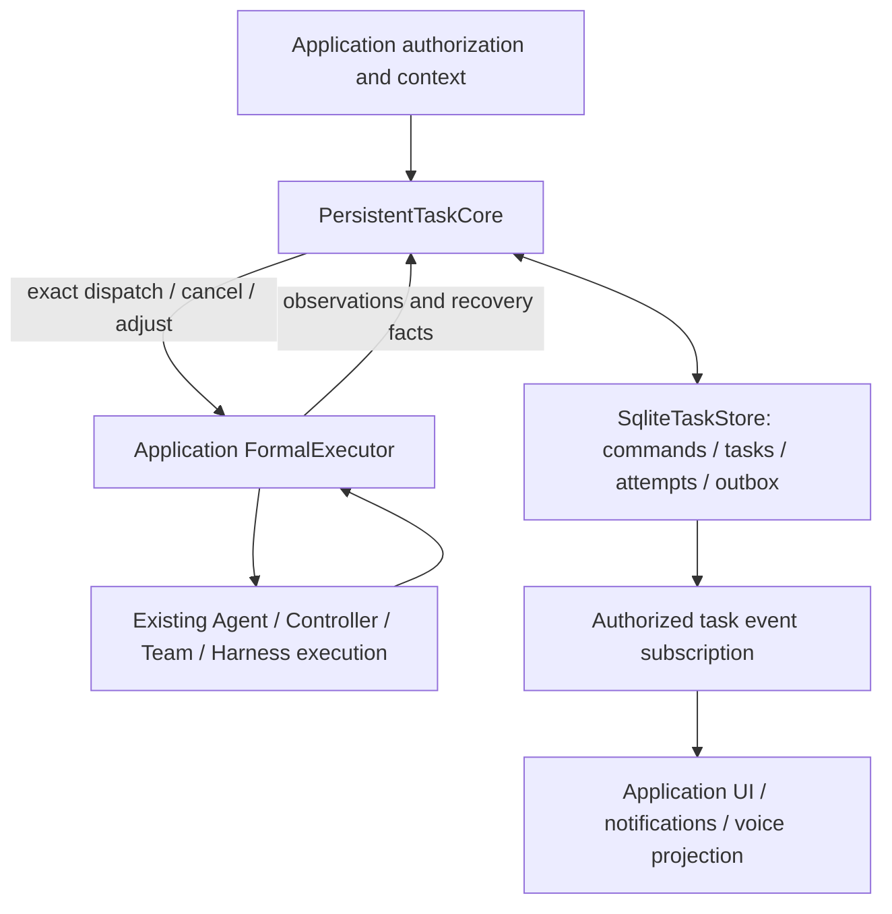

# Persistent application tasks

This addition is based on `b5f189ba1054a338d8fa3e009b13053776340e44`, the
AgentCore revision pinned by the consuming JiuwenSwarm branch. It extracts the
existing durable delivery implementation into `openjiuwen.core.application.tasks`.
It does not replace the Controller, TeamAgent or Harness task APIs.

## Capability comparison and reuse decisions

| Existing capability | Code and call flow | Relationship to this addition |
| --- | --- | --- |
| Controller tasks | `core/controller/schema/task.py`; `TaskManager.add_task/get_state/load_state` maintains indexed session tasks; `TaskScheduler` selects a registered executor by task type and streams its output | Reuse for Controller execution. Its task/session state, pause and output events are not the durable command/attempt/outbox protocol. Do not map a scheduler cancellation boolean to a committed delivery result. |
| Team tasks | `agent_teams/tools/task_manager.py`, `tools/database/task_dao.py`; task tools call the manager/DAO and publish team events for assignment, dependencies, completion and review | Reuse for team decomposition and coordination. A team's subtask ID is not automatically a user delivery ID or an execution attempt ID. No second team scheduler is added. |
| Harness asynchronous tools | `agent_teams/harness/async_tools.py`; invoke launches an async tool, tracks status/output, and injects completion via the owning harness; `tools/tool_async.py` provides list/output/cancel | Retain as the async tool runtime. It does not by itself prove durable outbox delivery, project effects or safe restart/retry. No duplicate async-tool loop is added. |
| Subagent execution | `harness/tools/subagent/task_tool.py` and existing Agent/Runner/model/tool loop | Remains the execution mechanism. The new core receives an application-supplied executor, not model credentials or a new Agent. |
| Session/checkpoint facilities | Existing session state and Agent checkpoint mechanisms | Retain for Agent execution state. New durability records bind the exact task/attempt/profile and external-effect prefix; they do not substitute a second conversation-memory implementation. |

The missing layer is durable **delivery authority**: accepted command versus
dispatched attempt, fenced adjustments and cancellation, at-most-once command
replay, scoped results, unknown outcomes and verified recovery facts. Those
responsibilities are additive to execution scheduling. No claim is made that
existing Controller or TeamAgent consumers now automatically use this store.

## Ownership and flow



- `formal_task_models.py`: immutable task, attempt, authority, result and recovery contracts.
- `task_store.py`: SQLite authority, exact command replay, attempt/outbox transactions and result facts.
- `persistent_task_core.py`: authorization and delivery orchestration through `FormalExecutor`.
- `task_adjustment_queue.py`: ordered changes and successor cutover without rewriting predecessor results.
- `task_event_subscription.py`: scoped event delivery and authoritative replay.
- `executor_capabilities.py`, `file_effect_plan.py`: executor declarations and file-effect contracts.
- `durability/`: checkpoint/effect identity, prefix verification, recovery facts and single-operation authorization.
- `contracts.py`: shared command/query/result/scope/progress values. Applications retain concrete identity and committed-input ledgers behind admission protocols.
- `source.py`: trusted, immutable source evidence codecs. Unknown or malformed evidence fails closed.

The initial admission profile deliberately retains the existing **project-mutation**
requirements, including exact model configuration and project-write context.
This is not yet a replacement for arbitrary read-only Work. Making admission
profiles generic is a separate behavioral change and is not silently introduced.

## JiuwenSwarm adapter boundary

JiuwenSwarm now imports this implementation. It still owns project authorization,
confirmation, model resolution, the concrete project/Agent adapter, and voice/UI
projection. Its `NativeTaskSource` implements `TaskSourceEvidence` and registers
the existing source version during module initialization. SDK code has no
JiuwenSwarm import and contains no Realtime client, microphone, turn ledger or UI.

The concrete project executor remains in JiuwenSwarm because it resolves its
project registry, configured Agent facade, tool registration and local project
baseline. Moving that adapter unchanged would introduce an SDK-to-application
dependency. It uses the SDK's task/durability contracts and existing Agent rails.

Applications instantiate `SqliteTaskStore(path)` and
`PersistentTaskCore(store, executor)`, validate their entrypoint, then call
`execute(command, grant, context=resolved_context)` and drain the outbox. A
successful creation receipt means accepted, not executed. An executor must
return exact attempt observations; queued, timeout and unknown must not claim
completion. `tests/integration_tests/application_tasks/test_application_boundary.py`
is a runnable application-independent admission/delivery/reopen example.

## Compatibility and verification

SQLite schema version 6 and existing serialized identifiers/keys remain unchanged.
Legacy wire strings (`live-voice.contract.v2`, `native_source`, and namespaced
extensions) remain readable; they are compatibility values, not SDK imports.
The originating application's source decoder remains mandatory when source data
is present. A missing decoder never downgrades a record to legacy/no-source.

Run:

```powershell
python -m pytest -q -o addopts= -o asyncio_mode=auto tests/integration_tests/application_tasks
python -m ruff check openjiuwen/core/application/tasks tests/integration_tests/application_tasks
```

These tests use real temporary SQLite files and deterministic executor facts.
They establish SDK/storage boundaries, not physical voice or cloud-model acceptance.

## Local distribution

The branch package version is `0.1.17+livevoice.1`; official `0.1.17` does not
contain this addition and must not satisfy the consuming application's pin.
JiuwenSwarm uses the sibling `../agent-core` editable uv source for local
work. For wheel installation, install the matching SDK wheel together with
the Host wheel. Neither this version nor the branch commit is assumed published.

Validation for this migration: 102 SDK application-task tests, plus 57 existing
Controller TaskManager/TaskExecutor tests pass (159 combined). Ruff passes.
Host integration additionally exercises task creation/delivery, SQLite replay,
adjust/cancel/recovery, project file effects, real SDK tool registration and
source validation. A wheel-to-wheel import verifies the packaged Host uses the
packaged SDK task implementation. Physical audio/cloud-model acceptance and
migration of Work remain outside this change.
